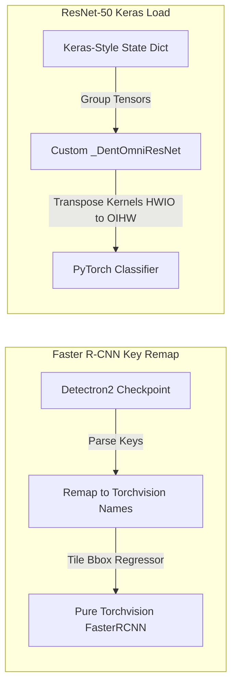

# DentOmni 🦷
### *AI-Powered Dental Diagnostic & Image Analysis Platform*


<div align="center">

[](https://fastapi.tiangolo.com)
[](https://pytorch.org)
[](https://huggingface.co/spaces/ShivankXD/DentOmni)
[](https://www.docker.com)
[](https://opensource.org/licenses/MIT)

</div>

---

## 📖 Overview

**DentOmni** is a state-of-the-art dental diagnostic platform that utilizes advanced computer vision models to automate the detection of common dental pathologies from radiographic scans (X-rays). Specifically, the platform detects:
1. **Dental Caries (Cavities)** 🦷
2. **Periapical Lesions (Root Infections)** 🦠

By combining a high-performance **FastAPI backend** running deep learning models with a **premium glassmorphic web UI**, DentOmni makes advanced dental image analysis accessible, fast, and highly interactive.

---

## 🛠️ System Architecture

DentOmni uses a decoupled architecture with a Python-based REST API backend and a responsive, interactive frontend. 


---

## ✨ Features

*   🧠 **Dual-Model Inference Engine**:
    *   **Faster R-CNN (Object Detection)**: Pinpoints specific regions of interest. Draws bounding boxes on the X-ray with labels (`Caries` or `Periapical Lesion`) and precision confidence scores.
    *   **ResNet-50 (Classifier)**: Performs multi-label classification to verify if caries or lesions are present anywhere in the scan.
*   ⚡ **Zero-Dependency Windows Execution**: Running Detectron2 on Windows normally requires native C++ compilation. DentOmni includes a custom translation layer that remaps Detectron2 checkpoints directly into pure PyTorch `torchvision` layers—making the platform run instantly out-of-the-box on Windows.
*   🦷 **Premium Clinic-Ready Web UI**:
    *   **X-Ray Slider (Before/After)**: Slide to compare the raw dental X-ray with the AI-annotated diagnostic boxes in real-time.
    *   **Interactive 3D Floating Tooth**: Floating micro-animated tooth graphic with glow effects and orbiting subatomic neural nodes.
    *   **Patient Diagnostic History**: Sidebar to browse, search, and manage patient records stored locally in browser storage.
    *   **Instant PDF Reports**: Generate styled, clinical-ready diagnostic report PDFs containing analysis metrics in one click.

---

## 🔬 Deep Dive: Custom Weights Remapping

To allow easy development, local running, and lightweight containerization, DentOmni bypasses traditional model-loading dependencies with two custom remapping scripts:



### 1. Faster R-CNN Remapping (`_remap_detectron2_to_torchvision`)
The model weights (`FINAL_dental_model.pth`) are saved in a Detectron2 format. During startup, the backend parses these keys:
*   Maps backbone names (e.g. `backbone.bottom_up.stem.conv1.norm.*` ➡️ `backbone.body.bn1.*`).
*   Resolves class discrepancies. Detectron2 saves class-agnostic bounding box regressions `[4, in_features]`, whereas torchvision expects class-specific regressions `[num_classes * 4, in_features]`. The custom loader automatically tiles the regression weights to align the parameters perfectly.

### 2. ResNet-50 Keras-Style Parser (`_load_keras_weights_into_resnet`)
The classifier model (`FINAL_resnet50.pth`) is saved as Keras-ordered weights inside a PyTorch container. 
*   Keras weights use `HWIO` shape ordering for convolution kernels, whereas PyTorch expects `OIHW`. The loader transposes the tensors on-the-fly (`kt.permute(3, 2, 0, 1)`).
*   Batch normalization values are ordered differently in Keras: `[beta, gamma, mean, unk, var]`. The loader parses this sequence, extracts the parameters, and copies them to the respective PyTorch BN channels.

---

## 🚀 Quick Start

You can run DentOmni locally in two ways.

### Method 1: Using Batch Scripts (Windows)
We provide two pre-configured startup scripts to easily run both components:
1. Double-click `start_backend.bat` (launches uvicorn server on `http://localhost:8000`).
2. Double-click `start_frontend.bat` (spins up a local server on `http://localhost:3000` and opens the web application).

---

### Method 2: Manual Launch (Any OS)
1. **Clone the Repository**:
   ```bash
   git clone https://github.com/ShivankXD/DentOmni.git
   cd DentOmni
   ```
2. **Install Requirements**:
   ```bash
   pip install -r requirements.txt
   ```
3. **Run the Backend (FastAPI)**:
   ```bash
   python -m uvicorn backend.main:app --host 0.0.0.0 --port 8000
   ```
4. **Run the Frontend**:
   ```bash
   # In a new terminal window
   python -m http.server 3000 --bind 127.0.0.1
   ```
   Open `http://localhost:3000/dentaai2.html` in your browser.

---

## 🐳 Docker Deployment

To build and run DentOmni inside a containerized Docker environment:

```bash
# Build the Docker image
docker build -t dentomni:latest .

# Run the container
docker run -p 7860:7860 dentomni:latest
```

The application will be accessible at `http://localhost:7860`.

---

## 📡 API Reference

The backend exposes a FastAPI interactive API dashboard at `http://localhost:8000/docs`.

### Key Endpoints

| Method | Endpoint | Description | Query/Form Parameters | Response |
| :--- | :--- | :--- | :--- | :--- |
| **`GET`** | `/` | Serves the main frontend page (`dentaai2.html`) or API status. | None | HTML or JSON |
| **`GET`** | `/health` | Check backend service health and classes list. | None | JSON |
| **`POST`** | `/predict` | Evaluates dental pathology on uploaded X-ray. | `file` (Image), `model` (`faster_rcnn` / `resnet50`) | Bounding boxes, confidence scores, and base64 annotated image |
| **`GET`** | `/before_panoramic.jpg` | Serves sample raw panoramic X-ray image. | None | Image File |
| **`GET`** | `/after_panoramic.jpg` | Serves sample annotated panoramic X-ray image. | None | Image File |

---

## 📜 License
Distributed under the MIT License. See `LICENSE` for more information.

---
<p align="center">Made with 🦷 by <a href="https://github.com/ShivankXD">ShivankXD</a></p>
