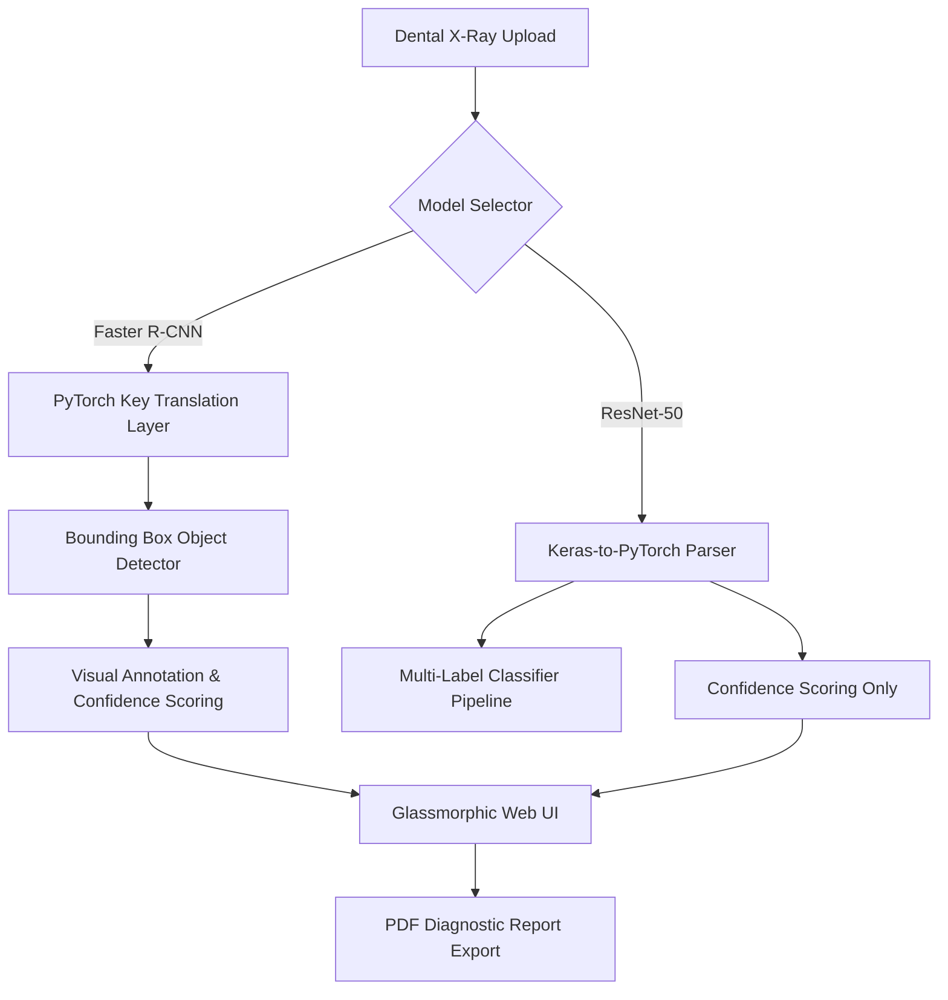
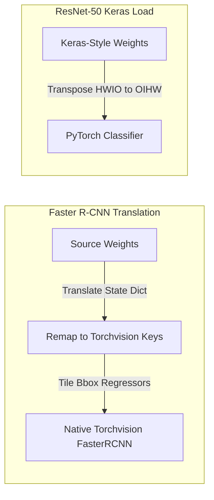

# DentOmni 🦷
### *AI-Powered Dental Diagnostic & Radiograph Analysis Platform*


<div align="center">

[](https://fastapi.tiangolo.com)
[](https://pytorch.org)
[](https://huggingface.co/spaces/ShivankXD/DentOmni)
[](https://www.docker.com)
[](https://opensource.org/licenses/MIT)

</div>

---

## 📖 Overview
**DentOmni** is a high-performance clinical dental diagnostic platform that utilizes deep learning computer vision to automate pathology detection from radiographic X-rays.
*   **Dental Caries (Cavities)** 🦷
*   **Periapical Lesions (Root Infections)** 🦠

Combining a robust **FastAPI backend** running PyTorch inference with a **glassmorphic, interactive web interface**, DentOmni delivers real-time diagnostic insights and automated clinical reporting.

---

## 🛠️ System Architecture


---

## ✨ Features
*   🧠 **Dual-Model Inference**:
    *   **Faster R-CNN (Object Detection)**: Pinpoints specific caries and periapical lesion instances, rendering color-coded bounding boxes and detection confidence values directly onto X-rays.
    *   **ResNet-50 (Classifier)**: Multi-label classification to verify pathology presence and compute general diagnostic confidence levels.
*   ⚡ **Zero-Dependency Execution**: Custom internal state-dict translators load pre-trained weights directly into native PyTorch `torchvision` modules, bypassing compilation complexities and external package dependencies.
*   🦷 **Premium Clinical Frontend**:
    *   **Interactive X-Ray Slider**: Real-time slider to overlay and compare the raw radiograph with AI-detected annotations.
    *   **3D Orbit Animation**: Features a custom floating tooth element with micro-animations and orbital neural nodes.
    *   **Patient Diagnostic History**: Sidebar to browse, search, and manage patient records stored locally in browser storage.
    *   **Instant PDF Reports**: Generate ready-to-print clinic diagnostic report PDFs in a single click.

---

## 🔬 Custom Weights Translation
To ensure seamless, cross-platform deployment, DentOmni implements on-the-fly model translation to load training weights directly into standard PyTorch modules:

*   **Faster R-CNN Translation**: Translates and maps state-dict keys on-the-fly to load directly into standard `torchvision.models.detection.fasterrcnn_resnet50_fpn`. It also automatically tiles the bounding box regression layers to align mismatching class shapes.
*   **ResNet-50 Keras Parser**: Transposes convolution kernels from Keras `HWIO` shape ordering to PyTorch `OIHW` format, and maps batch normalization sequences `[beta, gamma, mean, unk, var]` to native PyTorch parameters.

---

## 🚀 Quick Start
### Method 1: Using Batch Scripts (Windows)
1. Run `start_backend.bat` to launch the FastAPI server on `http://localhost:8000`.
2. Run `start_frontend.bat` to launch the frontend server on `http://localhost:3000` and automatically open your browser.

### Method 2: Manual Shell Startup (Cross-Platform)
```bash
# Clone the repository and navigate inside
git clone https://github.com/ShivankXD/DentOmni.git
cd DentOmni

# Install requirements
pip install -r requirements.txt

# Run FastAPI backend
python -m uvicorn backend.main:app --host 0.0.0.0 --port 8000

# Run local frontend server in a new terminal
python -m http.server 3000 --bind 127.0.0.1
```
Navigate to `http://localhost:3000/dentaai2.html`.

---

## 🐳 Docker Deployment
Build and run the containerized application:
```bash
docker build -t dentomni:latest .
docker run -p 7860:7860 dentomni:latest
```
Access the application at `http://localhost:7860`.

---

## 📡 API Reference
Interactive swagger documentation is available at `http://localhost:8000/docs`.

| Method | Endpoint | Description | Query/Form Parameters | Response |
| :--- | :--- | :--- | :--- | :--- |
| **`GET`** | `/` | Serves the main UI page (`dentaai2.html`) or API details. | None | HTML or JSON |
| **`GET`** | `/health` | Fetch backend server status and target pathology classes. | None | JSON |
| **`POST`** | `/predict` | Runs diagnostic inference on uploaded X-rays. | `file` (Image), `model` (`faster_rcnn` / `resnet50`) | Bounding boxes, confidence scores, and base64 annotated image |
| **`GET`** | `/before_panoramic.jpg` | Serves sample raw panoramic X-ray image. | None | Image File |
| **`GET`** | `/after_panoramic.jpg` | Serves sample annotated panoramic X-ray image. | None | Image File |

---

## 📜 License
Distributed under the MIT License. See `LICENSE` for more details.

---
<p align="center">Made with 🦷 by <a href="https://github.com/ShivankXD">ShivankXD</a></p>
